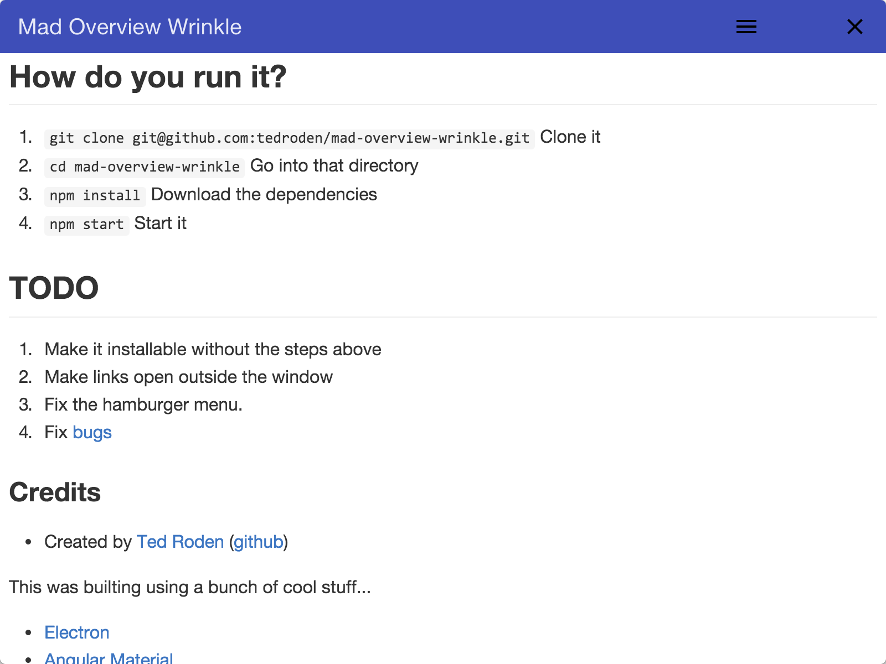
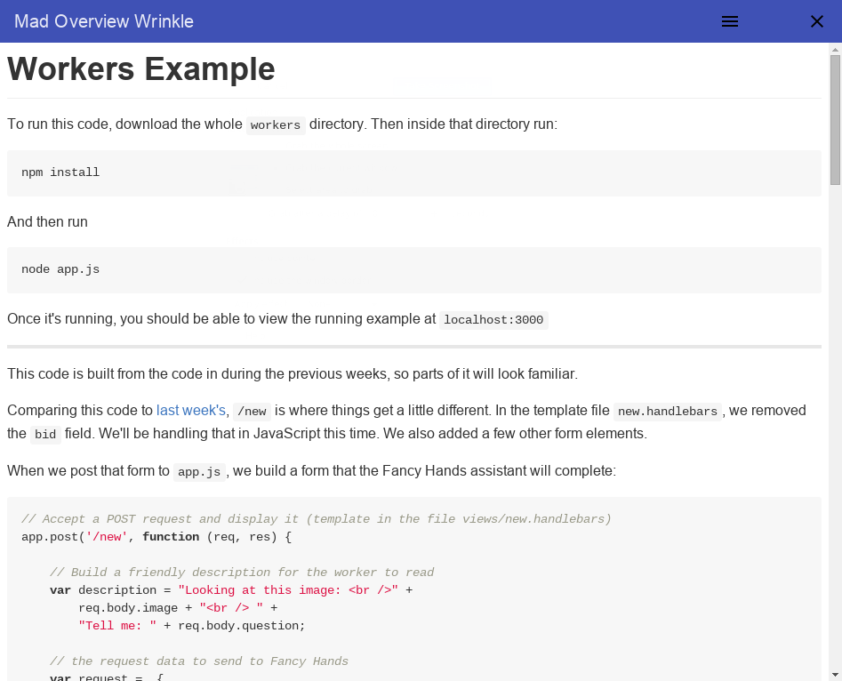

# Mad Overview Wrinkle 

**Mad Overview Wrinkle** is a **Live Markdown Viewer**. It monitors a markdown file, automatically converts it to HTML, and renders it in a pretty window. Specifically, it tries to show you what the file will look like on github. 

How does it work?

1. Edit your code in any editor.
1. Look at it.

[Download it here](https://github.com/tedroden/mad-overview-wrinkle/releases)


## What does it look like?


----

----


## How do you run it?

1. ```git clone git@github.com:tedroden/mad-overview-wrinkle.git``` Clone it
1. ```cd mad-overview-wrinkle``` Go into that directory
1. ```npm install``` Download the dependencies
1. ```npm start``` Start it

## TODO

 - Make all links open outside the window
 - Fix [bugs](https://github.com/tedroden/mad-overview-wrinkle/issues)
 - ~~Make it installable without the steps above~~ [View Releases](https://github.com/tedroden/mad-overview-wrinkle/releases)
 - ~~Fix the hamburger menu positioning~~

## New!

 - I swapped it out `marked` with `markdown-it` and `markdown-it-footnote` to support footnotes! [^1]

### Credits

 - Created by [Ted Roden](https://twitter.com/tedroden) ([github](https://github.com/tedroden))

This was builting using a bunch of cool stuff...

 - [Electron](http://electron.atom.io/)
 - [Angular Material](https://material.angularjs.org/latest/) 
 - [highlight.js](https://highlightjs.org/)
 - ~~[Marked](https://github.com/chjj/marked/)~~
 - [markdown-it](https://github.com/markdown-it/markdown-it/)
 - [markdown-it-footnote](https://github.com/markdown-it/markdown-it-footnote)
 - [md5](https://www.npmjs.com/package/md5)
 - [a Google Icon](https://design.google.com/icons/#ic_close) (the close button)
 - [Typebase.css](http://devinhunt.github.io/typebase.css/)
 - [github-markdown-css](https://github.com/sindresorhus/github-markdown-css)

[^1]: Here's one!
